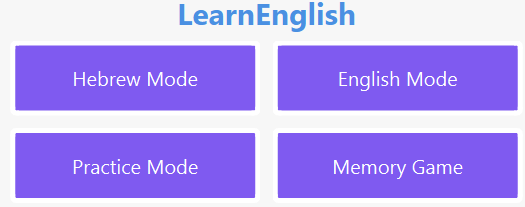

# 🎓 Learn English - Interactive Learning Application

  

## 📝 Overview

**Learn English** is an interactive learning application built with C++ and the Qt Framework.  
Designed for Hebrew speakers, this application provides multiple engaging learning modes to improve English vocabulary and comprehension.

## 🚀 Features at a Glance

✅ **Multiple Learning Modes**: Translation, Practice, and Memory Game  
✅ **5 Difficulty Levels**: Beginner to Advanced  
✅ **Text-to-Speech Support**: Hear English and Hebrew pronunciations  
✅ **Real-time Feedback**: Instantly see if your answer is correct  
✅ **Score Tracking**: Monitor your progress over time  
✅ **Bilingual Interface**: Full Hebrew and English support

---

## 📝 Download & Installation

### 🔗 [Download Latest Release](https://github.com/itzhaksh/EnglishLearningApp/releases/download/v1.0.1/LearnEnglish-v1.0.1.zip)

### Installation Instructions

1. **Download the ZIP file** from the link above.
2. **Extract all files** to a folder on your computer.
3. **Run `LearnEnglish.exe`** and start learning!
4. Make sure all **DLL files remain in the same folder** as the EXE.

🚠 **If the application does not start:**  
✔ Ensure all DLL files are present in the same folder as the EXE.  
✔ Try running the app as **Administrator**.  
✔ Update your **Microsoft Visual C++ Redistributable**:  
🔗 [Download Here](https://learn.microsoft.com/en-us/cpp/windows/latest-supported-vc-redist?view=msvc-170#latest-microsoft-visual-c-redistributable-version)

🚠 **If the vocabulary is missing:**
- Ensure the `resources/` folder and `dictionary_level{1-5}.json` files exist in the same directory.

---

## 🎮 Learning Modes

### 🔹 **Translation Mode**
- Translate words between English and Hebrew
- Real-time keyboard language detection
- Score tracking and progress monitoring
- Audio pronunciation for each word

### 🔹 **Practice Mode**
- Learn words at your own pace
- Listen to correct pronunciations
- Navigate through word lists

### 🔹 **Memory Game**
- Match English and Hebrew words
- Interactive card-matching system
- Visual feedback and tracking

---

## 🛠️ Technical Details

### 🏠 **Technology Stack**
- **Language**: C++
- **Framework**: Qt
- **Data Storage**: JSON files
- **Audio**: QTextToSpeech
- **UI**: Qt Widgets

## 🎨 User Interface

✔ **Modern and clean design** with a purple-blue color scheme  
✔ **Intuitive navigation** between screens  
✔ **Bilingual text support** (Hebrew & English)  
✔ **Clear visual feedback** when answering questions  
✔ **Dynamic game modes** with real-time updates

## 🔄 Game Flow

1. Start at MainWindow
2. Select game mode
3. Choose difficulty level
4. Play selected mode
5. Track progress
6. Return to main menu or continue playing

## 🎯 Educational Features

- Progressive difficulty levels
- Multiple learning approaches
- Interactive feedback
- Audio support for pronunciation
- Visual learning through memory game
- Immediate feedback system

## 👥 Recommended Speech Support

For the best experience, the application works optimally with Microsoft's English and Hebrew speech synthesis voices.

### How to Install Speech Packs in Windows:

1. Go to Start ⊞ and open Settings ⚙️.
2. Select **Time & language** > **Language**.
3. Select the language you want to add speech to, and then select the **Next** button.
4. Select the speech options you want included with the language.
5. Sign out and then sign back in for the new speech pack to be added to speech options.
6. Go back to **Settings ⚙️** > **Time & language** > **Language**, select your new language, and then use the up-arrow ⬆️ button to move it to the top of the list and make it the default.
7. Go to **Speech**, and make sure the **Speech language** setting is aligned with the previous settings.
8. Sign out and then sign back in for the new settings to take effect.

🔗 [Microsoft Guide: Download Language Pack for Speech](https://support.microsoft.com/en-us/windows/download-language-pack-for-speech-24d06ef3-ca09-ddcc-70a0-63606fd16394)

## 📧 Contact

For questions or suggestions, feel free to reach out at **[itzhakshif@gmail.com](mailto:itzhakshif@gmail.com)**.

This application provides a **comprehensive** learning experience for Hebrew speakers looking to improve their **English vocabulary and pronunciation** through interactive games and exercises.
